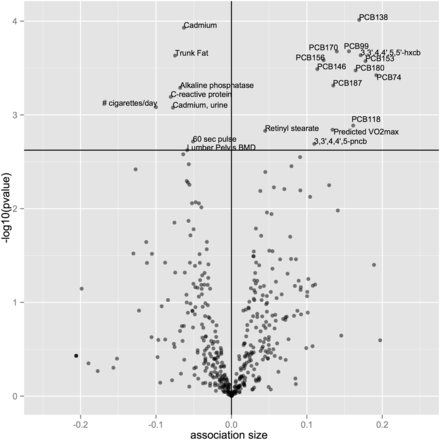

```{r setup, include=FALSE}
knitr::opts_chunk$set(echo=TRUE)
```

## 1. Setup

We'll assume you have compiled the `xwas` library from latest Github source. If you are using our provided Docker container then you can assume this is true. The two commands below will install in your R environment if necessary.

```{r eval=FALSE}
> library(devtools)
> install_github('chiragjp/xwas')
```

If you performed a `git checkout` of the code itself and ran your own build then the default build puts the library into `~/.R_libs/xwas/` and assumes your R library is set accordingly. The command below outputs the search path for R packages.

```{r}
.libPaths()
```

Now you can load the `xwas` package and are good to go.

```{r}
library(xwas)
```

Further validate it was successfully loaded by checking the `search()` output.

```{r}
search()
```

## 2. Package Survey

The `xwas` library comes with some data, load included NHANES datasets for downstream analyses.

```{r}
data(nhanes)
```


The data set is divided among two `data.frame`s as diagrammed in `Figure 1`. The `MainTable` has all the individuals represented by a row and columns with the co-variates. The `VarDescription` table has the description of what the co-variates are from the columns in `MainTable`.

## 3. Perform Regression Analysis

**Let's look at telomere length and see what environental exposures could influence it.**

First, what is the outcome variable codified as? Let's refer to the `VarDescription` table.

```{r}
VarDescription[grep("telomere", VarDescription$var_desc, ignore.case=T), ]
```

Mean telomere length is codified as `TELOMEAN` in the `MainTable` by looking at the `VarDescription$var` column. From the `VarDescription$series` column we can also see that the 1999-2000 and 2001-2002 cohorts are associated with this measurement.

Now lets conduct an EWAS on `TELOMEAN`, focusing only on variables present in these two cohorts where the mean telomere length (`TELOMEAN`) was measured.

```{r}
VarDescription.telo <- subset(VarDescription, series == '1999-2000' | series == '2001-2002')
```

Quick check on what this looks like by tabulating the `data.frame`. 

```{r}
sort(table(VarDescription.telo$category))
pie(sort(table(VarDescription.telo$category)))
```

The top two categories are "food component recall" and "pharmaceutical" with 256 and 252 entries, respectively. Let us focus our EWAS on the environmental exposures.

```{r}
useTheseCategories <- c('dioxins', 'furans', 'diakyl', 'heavy metals', 'hormone', 'hydrocarbons', 'pcbs', 'pesticides', 'physical fitness', 'phytoestrogens', 'polyflourochemicals', 'smoking behavior', 'smoking family', 'volatile compounds')
useTheseCategories <- sort(useTheseCategories) # store pre-sorted for easier processing

VarDescription.telo <- VarDescription.telo[VarDescription.telo$category %in% useTheseCategories, ]
```

Another inspection will confirm that we're looking at much more tractable set of data.

```{r}
pie(sort(table(VarDescription.telo$category)))
sort(table(VarDescription.telo$category))
```

The top two categories are now "pesticides" and "pcbs" with 64 and 59 entries, respectively. We're close to performing the actual EWAS but will now define specific co-variates to adjust for in each regression. The vector is defined below as `adjustfor` and then the combined with unique co-variates in our cohort as well as the dependent variable of mean telomere length we are interested in studying (`TELOMEAN`). 

We are also going to derive a new variable `RIDAGEYR2` which is the age-squared to test for non-linear effects associated with age.

```{r}
MainTable$RIDAGEYR2 <- MainTable$RIDAGEYR^2
```

The `newData` variable will contain all the pertinent records for analysis. However, the data is right-skewed so we both scale and log transform the data into a new object.

```{r}
adjustfor <- c('RIDAGEYR', 'RIDAGEYR2', 'female', 'mexican', 'black', 'other_eth', 'other_hispanic', 'INDFMPIR')
variablesToKeep <- c(unique(VarDescription.telo$var), 'TELOMEAN', adjustfor, 'SDMVPSU', 'SDMVSTRA', 'WTMEC2YR', 'WTMEC4YR')
newData <- subset(MainTable, SDDSRVYR <= 2)[, variablesToKeep] ## only keep those that are 

newLogData <- cbind(newData[, is.categorical(newData, lower=0)], apply(newData[, !is.categorical(newData, lower=0)], 2, function(x) { scale(log(x+1e-10)) })) # log transform the data
```

The `xwas` library also has integrated support for the `survey` package to perform survey-weighted analysis. You will have to define your own `survey::svydesign` objects but it's taken as an argument to most `xwas` functions. We define our study in the `dsn` variable then perform an EWAS both with and with-out the survey design for comparison.

```{r}
dsn <- svydesign(ids=~SDMVPSU, strata=~SDMVSTRA, weight=~WTMEC4YR, nest=T, data=subset(newLogData, WTMEC4YR > 0)) # create the design object

telo.norm <- xwas(data=subset(newLogData, WTMEC4YR > 0), depvar="TELOMEAN", adjvars=adjustfor, verbose=F) # ewas WITHOUT survey design
telo.surv <- xwas(data=subset(newLogData, WTMEC4YR > 0), depvar="TELOMEAN", adjvars=adjustfor, design=dsn, verbose=F) # ewas WITH survey design
```

As you can see the EWAS with survey-weighted analysis takes longer to perform but it is technically more accurate as you can see within the visualizations below.

## 4. Visualization

Now that we have performed the heavy lifting of EWAS analysis we can use the packaged visualization functions, specifically `manhattan`, `volcano`, and `qqplot` to gather insights into the relationship of environmental exposures to mean telomere length (`TELOMEAN`).

```{r}
par(mfrow=c(1,1), xpd=TRUE) # setup to plot outside of area if necessary
```

First look at a Manhattan plot of the telomere length without survey-weighted analysis.

```{r}
manhattan(telo.norm)
```

Since we looked at the co-variates by sub-categories of environmental exposure it also makes sense to show this visually. If we provided a mapping of variables to categories the Manhattan plot can show this.

```{r}
groups <- subset(VarDescription, category %in% useTheseCategories)[, c("category", "var")]
groups <- unique(groups)
```

Now by passing in this additional information we can show a more visually clear relationship. Let's look at the telomere study without survey-weighted analysis.

```{r}
manhattan(telo.norm, group.by=groups, legend=T, xlab="", ylim=c(0,14), nlabels=5)
```

Now we can compare this to the study done **with** survey-weighted analysis. You can see that there is less noise in the results and the significant co-variates are clearer.

```{r}
manhattan(telo.surv, group.by=groups, legend=T, xlab="", ylim=c(0,14), nlabels=5)
```

Given the results, let's convert to a more readable table and codify all the variables to their descriptions. We'll just print out the top 10 results by significance.

```{r}
top <- xwas.to.df(telo.surv) # convert xwas results to a data.frame

# create a table with the labels and descriptions for each variable used
labels <- subset(VarDescription, category %in% useTheseCategories)[, c("var", "var_desc", "category")]
labels <- labels[!duplicated(labels$var), ]
rownames(labels) <- labels$var

# match variables from the xwas output to the labels object
top <- merge(top, labels, all.x=TRUE, by="row.names")
rownames(top) <- top$Row.names
top <- top[, -which(colnames(top) %in% c("Row.names", "var"))]
top <- top[order(top$q), ]

# show the top 10 results with p-values and descriptions
head(top, n=10)
```

Another `xwas` visualization is the volcano plot that allows you to quickly discern both significance and effect size.

```{r}
volcano(telo.norm, xlim=c(-.2,.2), xlab="Association Size")
```

Notice how the visualizations change with the survey-weighted analysis results.

```{r}
volcano(telo.surv, xlim=c(-.2,.2), xlab="Association Size")
```

We can also compare our output above to [Figure 2 from the paper](http://ije.oxfordjournals.org/content/early/2016/04/07/ije.dyw043/F2.expansion.html) we're replicating.



An `xwas` visualization to determine significance is the `qqplot`. Any deviation from the line `y=x` indicates true signal in the associations. 

```{r}
qqplot(telo.norm, xlim=c(0,14), ylim=c(0,14))
```

Now with the survey-weighted data you can see that the signal:noise ratio is much more distinct.

```{r}
qqplot(telo.surv, xlim=c(0,14), ylim=c(0,14))
```

Additional visualizations and other features coming soon in future releases.